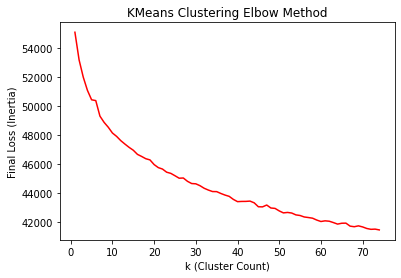

# Introduction

The primary goal of this project is to create a model that can accurately classify whether a social media comment is sarcastic or not. When given data containing a comment, parent comment, and topic, the model should be able to use this information in order to determine whether the the comment sentiment is sarcastic. Such a model could be incredibly important in the field of sentiment analysis as current NLP being used to understand subjective opinions doesn’t account for the fact that people may be sarcastic in their thoughts. This would entail that sentiment analysis cannot account for the intentions of people’s comments and needs to be more contextual. An application of this model would be for natural language bots/virtual assistants that may generate their own sarcastic comments  to seem more human-like. The overall impact of this on NLP and sentiment analysis would be very helpful to understanding further conversational, contextual analysis done by AI.

# Methods

The training data that we plan to use for this comes from the following:

- [Kaggle - Detect Sarcasm in Comments](https://www.kaggle.com/sachinichake/detect-sarcasm-in-comments?select=Train.csv)
- [Kaggle - Sarcasm on Reddit](https://www.kaggle.com/danofer/sarcasm)
- [Corpus of Sarcasm in Twitter Conversations](https://mendeley.figshare.com/articles/Corpus_of_Sarcasm_in_Twitter_Conversations/8962883)

Our data consists solely of tweets and comments on Reddit. The datasets provided by Kaggle contain over 1 millions preprocessed comments and other data. Our model will likely be trained by splitting the dataset into a train and test group. Another possible way for us to run this is by training it on one dataset and then testing it on others to find its accuracy. 

Our current plan is to take a variety of popular NLP algorithms like LSTM (long short-term memory) or BERT (Bidirectional Encoder Representations from Transformers) and modify them so that they can better detect sarcasm from multiple input strings. Another idea may be to analyze contextual sentences for keywords and underlying sentiment as sarcastic comments will likely have the opposite tone. This is subject to change as more research into this topic may reveal that there would be a more optimal way to implement a sarcasm detector.

# Unsupervised Learning with KMeans Clustering

In order to understand and visualize our data better, we took a multi-step approach to building an unsupervised Machine Learning Model. A detailed explanation of your code and reasoning can also be found in this Google Colaboratory Notebook:

[Colab - Unsupervised Learning](https://colab.research.google.com/drive/1nD-kY1FXvnYkyHTDvD61d7N5h5w7lk1Z?usp=sharing)

## Data Preprocessing

For our project, we primarily relied on the NLTK libraries which is commonly used for natural language processing.

The dataset that we performed our algorithms on was the reddit dataset from Kaggle that contained around 150,000 sarcastic and non-sarcastic comments. The dataset contained the following features for each comment: user ID, text of the comment, data, down, parent comment, score, top, date, topic, user name, and label. The labels are binary where 1's represent a sarcastic comment and 0's are not sarcastic.


The left bar of this graph shows the amount of non-sarcastic comments and the right bar shows the amount of sarcastic comments. The frequency of each in our dataset is roughly the same so the class distribution is not skewed.

The features that we dropped from our dataset due to irrelevance were User ID, comment date, no. of downvotes, top, and the username. We also decided to see if there was a correlation between sarcastic comments and upvotes but it doesn’t appear to be that way according to this scatterplot. 


Therefore, we also dropped upvote score. This left our dataset with only text data.

## Text Processing

In order to preprocess the text data, we needed to start by getting rid of unnecessary words and punctuation in the text. Punctuation is highly variable when used in sentences and stop words like “the” or “and” contribute very little to the meaning of the sentence so we should remove those as well. NLTK has a stop words library that we used to clean the text. This is the result of a sentence before and after text cleaning.

```
Original: Yay! That's amazing!
Modified: ['yay', '!', 'thats', 'amazing']
```

Then, we decided to use word embeddings to represent sentences as n-dimensional vectors. Using word2vec, a popular algorithm for vectorizing text, we can determine the similarity of sentences using a cosine similarity function on the embeddings.

In order to generate a vectorized representation of each comment in our dataset, we trained a neural network to create a 200 by 1 representation of each comment. We trained the model by using randomly selected 4000 comments from our original dataset. The vectorized representation of the comments do not contain outliers as unique words would be the only factor that generates an outlier but words that weren’t used more than 5 times were not counted in the vectorization. 

## K Means Algorithm and Elbow Method

The unsupervised learning algorithm that we used for this part of the project was the K means algorithm which attempts to find the optimal number of clusters that can be used to minimize the loss function which is defined as the summation of the distances between the centers and the other data points. We used the elbow method to determine the optimal number of clusters and used the Sci-kit Learn implementation of the K means algorithm. We generated the following graph after running K means with a max iteration of 1000 and up to 75 clusters.



Based on the above graph, the optimal number of clusters seems to be between 10 and 20. We can estimate that it is 15.

After determining the optimal number of clusters, we drew a comparison between the unsupervised algorithm and the labeled data using the results from the K means algorithm for 15 clusters. For the clusters, there was no defining way to separate sarcastic comments from non-sarcastic comments using this implementation. Pictured below are some of the clusters where blue represents the non-sarcastic comments and orange represents the sarcastic comments. All of the clusters looked very similar to the images below.


## Summary of Unsupervised Learning Findings

The K means algorithm did not prove to be an effective method for sarcasm detection as the clusters that we seemed to generate after determining the optimal number of clusters did not seem to organize the comments decisively. Intuitively, the reason for this would be a result of our text preprocessing algorithm. The points similarity does not indicate anything when using Euclidean distance between them but only when put through the cosine similarity function. Instead of using linear distance as the metric for determining loss in the K means algorithm, we could use the cosine function instead. This would be an area for us to look into over the following few weeks and may be more informative than the standard K means algorithm.

# Results

Our team hopes to generate a model that would be able to accurately classify comments as sarcastic given some degree of context. In a limited sense, this would allow us to see the number of tweets and reddit comments that are sarcastic. More generally though, our results could be very informative for the field of sentiment analysis and natural language processing. 

# Discussion

After our model is finished, we would ideally like to test it on a variety of different data sets so we can determine its accuracy. This would help us determine if it is overfit to the data that we have. The methods that we have outlined for how we would perform testing for our model lead us to believe that if it is overfit, it would be a fault of the algorithm due to the nature of the way that we are running tests. 

One of the ways we would like to use our model is to do an analysis of the tweets done by a variety of famous figures. Political figures, athletes, movie stars, etc. are all followed on twitter and a sarcasm model run on their tweets would be important to determine how seriously they should be taken. In some cases, it could even be a measure of how appropriately they handle their position. 

Another way our model would be effective is in the field of NLP itself. A model that is able to understand context dependent speech would be useful for chatbots or other interactive, intelligent models. We see these becoming more and more relevant as technology progresses towards devices that contain Siri, Alexa, etc. Our methodology could be used to train and progress a variety of speech based, conversational bots.

# References

- [https://web.stanford.edu/class/archive/cs/cs224n/cs224n.1194/reports/custom/15791781.pdf](https://web.stanford.edu/class/archive/cs/cs224n/cs224n.1194/reports/custom/15791781.pdf)
- [https://www.aclweb.org/anthology/C14-1022.pdf](https://www.aclweb.org/anthology/C14-1022.pdf)
- [http://citeseerx.ist.psu.edu/viewdoc/download?doi=10.1.1.800.4972&rep=rep1&type=pdf](http://citeseerx.ist.psu.edu/viewdoc/download?doi=10.1.1.800.4972&rep=rep1&type=pdf)

# Touch-Point 1 Deliverables

### Project Proposal Video

[https://bluejeans.com/s/tjvlm](https://bluejeans.com/s/tjvlm)

### Project Proposal Slide

[https://docs.google.com/presentation/d/1DiOc0nDUfCwI1mvO6MIp_5j9UZTssN1W7Jh6VkHPBsA/edit?usp=sharing](https://docs.google.com/presentation/d/1DiOc0nDUfCwI1mvO6MIp_5j9UZTssN1W7Jh6VkHPBsA/edit?usp=sharing)
